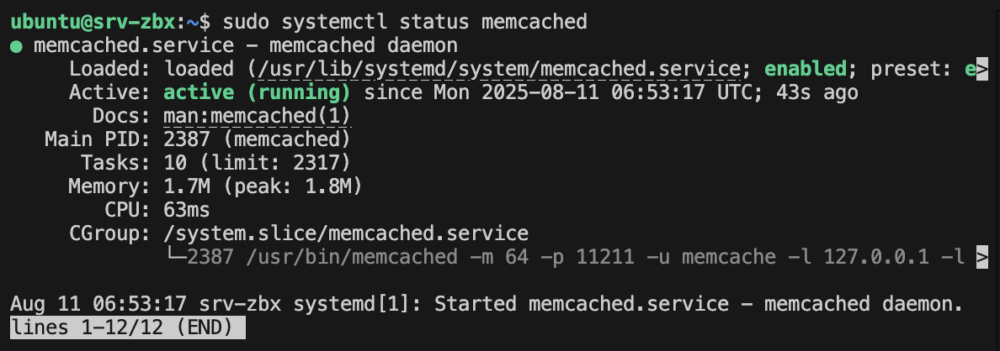
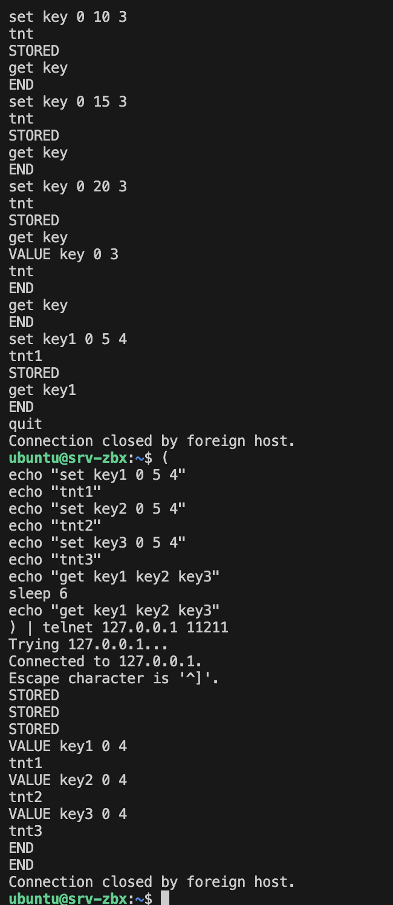
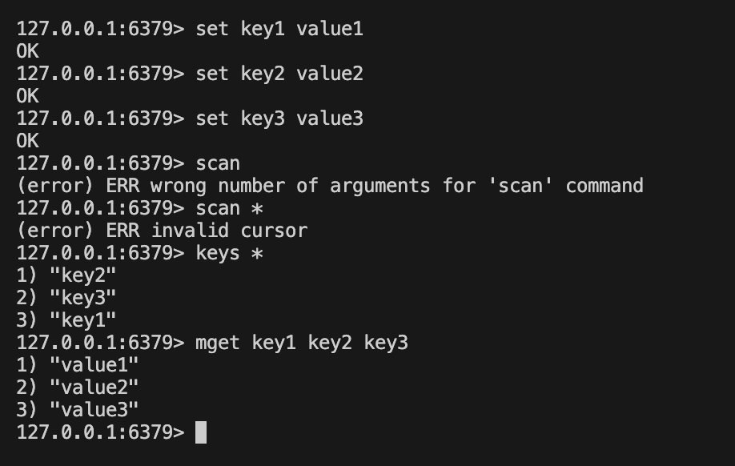
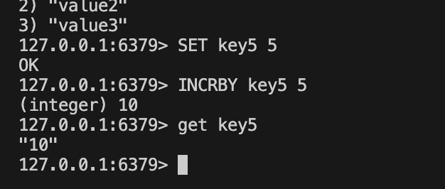

# sdb-homeworks2

# Домашнее задание «Кеширование Redis/memcached»

### Задание 1. Кеширование 

Приведите примеры проблем, которые может решить кеширование. 

### Ответ задание 1

Кеширование — это способ временно хранить уже полученные или вычисленные данные, чтобы повторно использовать их без повторного получения/вычисления.

1. Снижение нагрузки на сервер или базу данных
Кеширование результатов запроса в памяти, 
например: в Redis или в Memcached,
Они выдают ответ из кеша, не обращаясь каждый раз к БД.

2. Ускорение загрузки веб-страниц
Браузер сохраняет кеш локально, уменьшая время загрузки и количество запросов к серверу.

3. Сокращение времени отклика внешних API
Кеширование ответа API на определённое время

4. Отказоустойчивость
Кеш позволяет вернуть последнее сохранённое значение, пока проблема не устранена.

5. Сложные вычисления
Кеширование готового результата и при одинаковых входных данных быстрее выдает ответ.

---

### Задание 2. Memcached

Установите и запустите memcached.

*Приведите скриншот systemctl status memcached, где будет видно, что memcached запущен.*

### Ответ задание 2

---

### Задание 3. Удаление по TTL в Memcached

Запишите в memcached несколько ключей с любыми именами и значениями, для которых выставлен TTL 5. 

*Приведите скриншот, на котором видно, что спустя 5 секунд ключи удалились из базы.*

### Ответ задание 3

Руками не успеваешь, через echo успел

---

### Задание 4. Запись данных в Redis

Запишите в Redis несколько ключей с любыми именами и значениями. 

*Через redis-cli достаньте все записанные ключи и значения из базы, приведите скриншот этой операции.*

### Ответ задание 4

### Задание 5*. Работа с числами 

Запишите в Redis ключ key5 со значением типа "int" равным числу 5. Увеличьте его на 5, чтобы в итоге в значении лежало число 10.  

*Приведите скриншот, где будут проделаны все операции и будет видно, что значение key5 стало равно 10.*

### Ответ задание 5*

